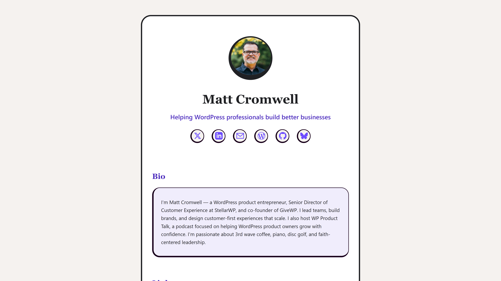
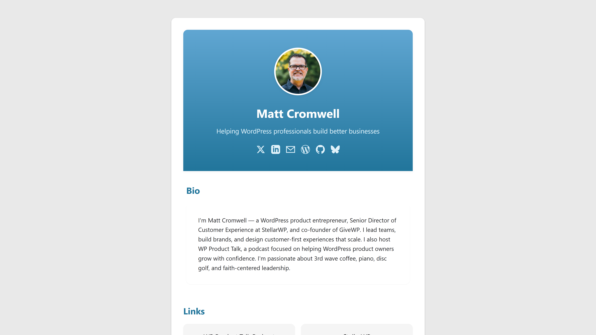
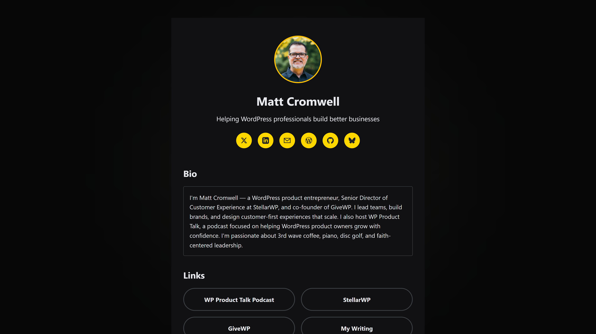
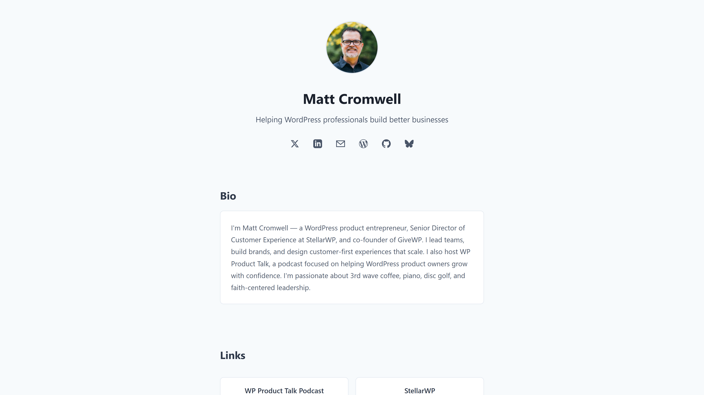

# Connect – a totally free, no-server bio site for tech folks ✨

Spin up a sleek "link-in-bio" page on **GitHub Pages** in minutes—no hosting bill, no complicated build chain.  
Perfect for product owners, devs, and anyone in tech who wants a home base that just works.


## Why you'll love it

* **Zero cost, zero fuss** – GitHub Pages handles the hosting and SSL.  
* **One JSON file, endless customisation** – update text, colours, and links without touching HTML.  
* **Gravatar-ready** – your profile pic is always in sync.  
* **Pulls in your latest blog posts** – drop an RSS feed in the config and you're done.  
* **Fully responsive** – looks sharp on every device.  
* **Custom domain ready** – add your own domain with a simple CNAME file.  
* **MIT-licensed** – remix it, ship it, brag about it.

## Quick-start (3 steps)

1. **Fork or "Use this template"**  
2. **Edit `config.json`**  
   ```json
   {
     "profile": {
       "name": "You",
       "tagline": "Build. Ship. Repeat.",
       "gravatarEmail": "you@example.com",
       "bio": "A short bio about yourself and what you do."
     },
     "social": {
       "x": "https://x.com/you",
       "linkedin": "https://linkedin.com/in/you",
       "email": "you@example.com"
     },
     "links": [
       { "title": "My Plugin", "url": "https://wordpress.org/plugins/awesome/" }
     ],
     "blog": {
       "rssFeed": "https://yourblog.com/feed/",
       "wordCount": 40
     },
     "support": {
       "buttonText": "Buy me coffee ☕",
       "url": "https://buymeacoffee.com/you"
     }
   }
   ```
3. **Enable GitHub Pages**  
   *Go to* **Settings → Pages → Source**, choose **main branch**, and save.  
   Your new site will be live at `https://<username>.github.io/`.

That's it—high-five! 🎉


## Theme Switcher – Make it yours

The `core.css` file simply holds the minimum layout styles and generally speaking doesn't need to change. 

The theme stylesheets are loaded dynamically via javascript. To set your default theme, simply define it in the `config.json` file; e.g. `"theme": "kubrik"` 

The "Theme Switcher" allows you to preview any theme via a query parameter in your url. Just append `?theme=bulky` to your url to see whichever theme you want. 

* **Switching themes** – Themes can be previewed dynamically based on a URL query parameter. To preview or share your site with a different theme, just add `?theme=bulky`, `?theme=kubrik`, `?theme=bright`, `?theme=dark`, or `?theme=minimal` to your URL, for example:
  
  `https://<username>.github.io/?theme=bulky`
  
  If no `theme` parameter is present, or if the value is invalid, the **minimal** theme will be loaded by default.
  
  To add a new theme, simply create a new CSS file in the `styles/` folder and add its name to the theme list in `main.js`.

* **Stylesheet tweaks** – Edit your theme file in the `styles/` folder for colors and effects, or edit `core.css` for layout tweaks.  
* **HTML changes** – everything lives in `index.html`. Keep it minimal or go wild.  
* **Custom domain** – add a `CNAME` file with your domain name to use your own URL.

## Available Themes


| Theme   | Description | Main Colors | Screenshot |
|---------|-------------|-------------|------------|
| **bulky** | Large, bold, soft, and modern. Features pill-shaped buttons, thick borders, and a playful, accessible look. |  `#a18aff` (button)<br> `#6c4cff` (accent)<br> `#f5f2ef` (background)<br> `#18001a` (border) | |
| **kubrik** | Inspired by classic WordPress themes. Clean, blue-accented, with soft gradients and subtle shadows. |  `#21759b` (blue)<br> `#60a6d2` (light blue)<br> `#e9e9e9` (background) | |
| **bright** | Vivid, modern, and energetic. Uses a blue/yellow/purple gradient background and crisp white cards. |  `#1a73e8` (blue)<br> `#0d47a1` (hover)<br> `#ffffff` (background) |  |
| **dark** | High-contrast, accessible dark mode. Gold/yellow accents on a deep black background. |  `#FFD700` (gold)<br> `#202124` (text)<br> `#070708` (background) |  |
| **minimal** | Ultra-simple, clean, and neutral. |  `#2d3748` (text)<br> `#f7fafc` (background) |  |


## Contribute

Have a fresh style or nifty improvement?  
PRs that enhance the stylesheet, improve performance, add new themes, or overall accessibility are always welcome.


## Feedback

Questions, ideas, or you just deployed your own?  
Open an issue or ping me on [X](https://x.com/learnwithmattc) — I'd love to see and share your Connect page with the world.


## License

[MIT](LICENSE) – free to use, modify, and share.
